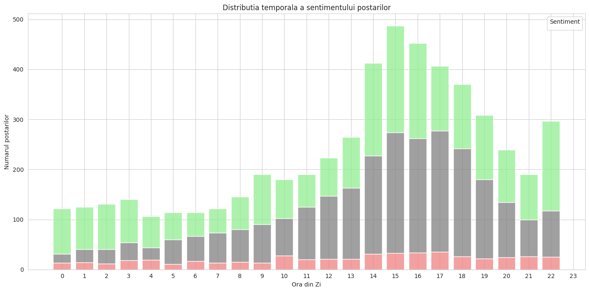
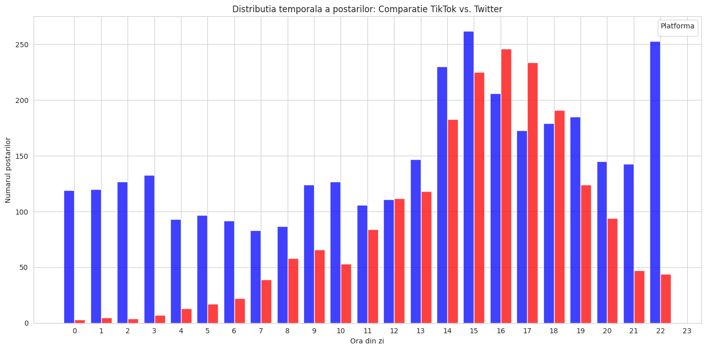
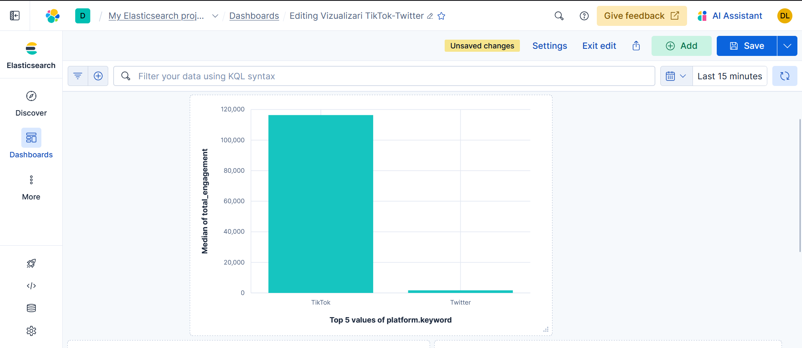
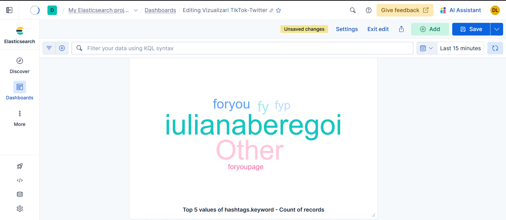
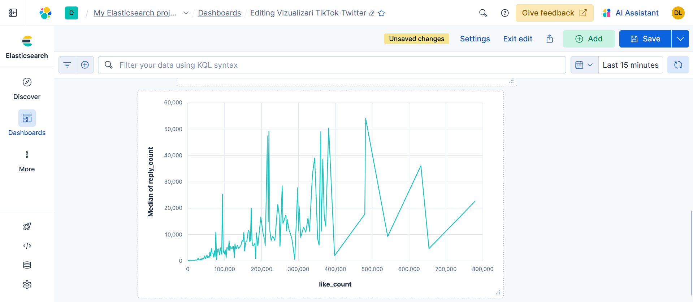
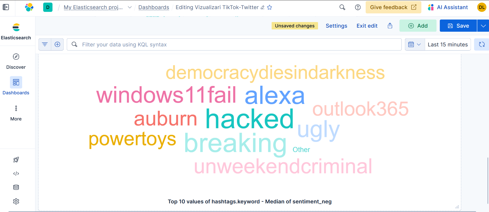

# Proiect OSINT

Proiectul demonstrează o analiză amănunțită a datelor Open Source Intelligence (OSINT) extrase de pe TikTok și Twitter (X). Obiectivul este de a depăși analiza de suprafață, concentrându-ne pe descoperirea de tipare ascunse, conexiuni indirecte și corelații între utilizatori, subiecte și platforme. Pentru o mai bună înțelegere a acestei analize s-a utilizat Elastic Stack (Elasticsearch și Kibana) pentru o vizualizare interactivă.   

### Structura tehnica și Arhitectura Datelor

Datele brute sunt preluate din 7 fișiere, și anume 2 TikTok și 5 Twitter, ce sunt în format NDJSON.
Pentru extracția datelor s-au folosit funcțiile extract_twitter_data() și extract_tiktok_data() ce navigheză prin structura complexă JSON, și returnează datele importante pentru analiza comparativă sub forma câmpurilor standard din UNIFIED_COLUMNS. 

Funcția process_all_files() este un pas important al etapei de ingestie și pregătire a datelor.
Rolul său principal este de a gestiona fișierele .json și .ndjson și de a le unifica. Aceasta iterează prin directorul sursă, aplică funcțiile de extracție pentru TikTok și Twitter și folosește pd.concat pentru a asambla DataFrames-urile individuale într-un singur set de date uniform, și anume final_data. 

Textul a fost curățat cu ajutorul funcției clean_text() ce a eliminat zgomotul (menționări, link-uri etc.) pentru ca analiza de sentiment să nu fie distorsionată, urmând eliminarea duplicatelor pentru asigurarea unicității datelor.

### Analiza de Sentiment

S-a utilizat modelul VADER (Valence Aware Dictionary and sEntiment Reasoner) pentru a clasifica fiecare postare (Positive, Negative, Neutral), creând câmpul analitic sentiment_category. Analiza VADER a arătat că discuțiile sunt predominant neutre/pozitive, iar sentimentul negativ (roșu) nu crește proporțional cu volumul, indicând că majoritatea postărilor sunt motivate de evenimente pozitive (verde) sau neutre (gri).

Vizualizarea din Kibana, intareste rezultatele obtinute mai sus, prin reprezentarea sentimentelor pe intregul set de postari. Se poate observa majoritatea postarilor sunt pozitive/neutre (aprox. 90%), pe cand doar aprox. 9% sunt negative. 

### Modelarea Grafului

S-a implementat un model tripartit cu trei tipuri de Noduri (USER, POST, HASHTAG) și două tipuri de Muchii (POSTED, USES). S-a utilizat H_viz pentru a filtra nodurile POST, creând o vizualizare lizibilă care arată direct relația USER - HASHTAG.  Calculul centralității de grad a permis stilizarea analitică a grafului, iar diferențierea culorii și a grosimii textului a permis distingerea vizuală a nodurilor USER (roșu) de HASHTAG (verde).

Graful a confirmat o fragmentare tematică. Nodurile de top nu sunt conectate între ele, ele formează clustere tematice, spre exemplu grupul foryoupage este separat de cosmos, indicând că influența este concentrată pe nișe.

### Analiza Temporală Comparativă

Histograma comparativă arată când publică cele două platforme.
Twitter (Albastru) domină volumul de postări în timpul zilei (vârfuri la 14:00 - 18:00 ), sugerând că este folosit pentru știri și discuții în timpul orelor de lucru europene.

### Ingestia și Vizualizarea Datelor

S-a utilizat Elastic Cloud pentru stocarea datelor. Datele curățate au fost încărcate în indexul Elasticsearch prin intermediul funcției bulk din Python, demonstrând eficiența în gestionarea volumelor mari de date și anume 5331 de documente în câteva secunde.

După ingestia datelor s-au realizat vizualizări în Kibana pentru observarea anumitor corelații dintre câmpuri.

Vizualizarea Median Engagement per Platformă demonstrează că TikTok generează un Engagement Median per postare mult mai mare decât Twitter.

Pentru o observare a temelor dominante și a strategiilor de vizualizare s-a realizat un Tag Cloud ce reprezintă 5 cele mai folosite hashtag-uri. Se pot observa cuvintele foryou, fyp etc. ce sunt specifice TikTok-ului. 

A fost creat un grafic linie ce arată relația dintre Like-uri și Mediana Comentariilor. Se poate observa că mărimile sunt în general proporționale, dacă numărul like-urilor crește va crește și numărul comentariilor, dar se pot observa și câteva vârfuri ce pot demonstra că există postări ce au un număr moderat de like-uri, dar un număr disproporționat de mare de comentarii, indicând un eveniment ce atrage atenția, precum o discuție intensă sau controversă.

Pentru a vedea temele de conflict, a fost folosit un Tag Cloud pe sentiment negativ, ce prezintă 10 cele mai folosite hashtag-uri la postări ce au fost clasificate ca având sentiment negativ. Tag Cloud-ul dezvăluie aceste teme ca fiind: Securitate Cibernetică/Tehnică (windows11fail, hacked, powertoys) și probleme Sociale/Politice (democracydiesindarkness, unweekendcriminal).

